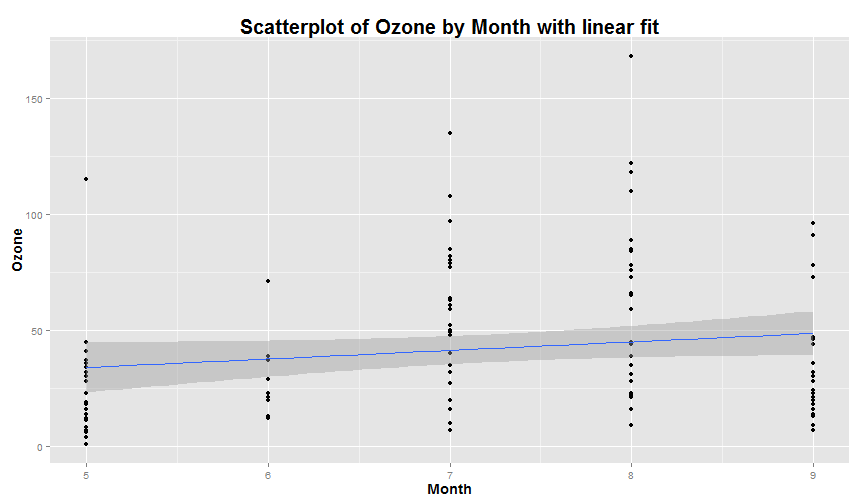

---
title       : Visual regression of Air Quality Dataset
subtitle    : Developing Data Products Course Project
author      : Jason O. Jensen
job         : 
framework   : io2012        # {io2012, html5slides, shower, dzslides, ...}
highlighter : highlight.js  # {highlight.js, prettify, highlight}
hitheme     : tomorrow      # 
widgets     : []            # {mathjax, quiz, bootstrap}
mode        : selfcontained # {standalone, draft}
knit        : slidify::knit2slides
--- .current

## A Pedagogical Tool

The simple app produced by this project allows users to gain intuitive understanding of simple linear regression by showing the link between a scatterplot of two variables and the fitted line.

The workhorse of the app is a simple ggplot:


```r
library(ggplot2)
p <- ggplot(airquality, aes(x = Month, y = Ozone))
p <- p + geom_point()
p <- p + geom_smooth(method = lm)
p <- p + labs(title = "Scatterplot of Ozone by Month with linear fit")
p <- p + theme(plot.title = element_text(lineheight = 3, face = "bold", color = "black", 
    size = 20))
p <- p + theme(axis.title.x = element_text(lineheight = 1.5, face = "bold", 
    color = "black", size = 14))
p <- p + theme(axis.title.y = element_text(lineheight = 1.5, face = "bold", 
    color = "black", size = 14))
```


--- .class #id 

## Graphical Linear Regression


```r
p
```




--- .class #id 

## Options

Users can choose any combination of the six available variables:

- Ozone
- Solar.R
- Wind
- Temp
- Month
- Day

The App then displays a scatterplot with a fitted Least-Squares line, and the formula for the fitted line.


--- {class: .class, id: id}

## Current Issues
The current build is not completely free of bugs. At least one is known.

<br />

<div style='float:left;width:48%'>

<h3>Bug</h3>

<p>Some selections will not result in a graph being produced. Instead the outputs (graph and regression equation), will gray out.</p>
</div>

<div style='float:right;width:48%'>
 
<h3>Workaround</h3>

<p>In general, changing the selection twice remedies this problem. THe user can obtain the output for the original desired combination this way.</p>
</div>

### App Link
https://jasonjensen.shinyapps.io/Visual_Regression_of_Air_Quality_Dataset/
